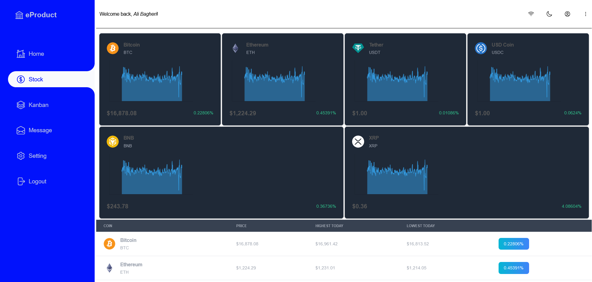

# [Demo React Dashboard](https://react-ts-dashboard.netlify.app/)



## Features

1. Advance folder structure
2. github branching system (`github flow`)
3. add `husky`, `lint-staged` for precommit
4. use `eslint`, `prettier` for linting an formating
5. linting style with `stylelint`
6. use `tailwind` with `postcss`
7. create style component with `emotion`
8. absolute path import
9. use `typescript` from `vite template`
10. using `custom svg component` and `hero icon library`
11. use `react suite` ui framework
12. using many state managment library such as: `rematch`, `recoil`, `mobx` and `jotai`
13. routing strategy with `react router` and `tanstach router`
14. use `chart.js` with `react-charjs-2`
15. create many pages with tailwind library; `flowbite`, `preline`
16. add custom title with `react helmet` and `useDocumentTitle` custom hook
17. create generic id with `uuid`
18. using `crypto` and `fake store` api
19. package installer: `pnpm`

## Project Plans

- [See project planes on Notion](https://ruddy-tellurium-2b3.notion.site/327b380f72db4393b3b08fe14e25dea4?v=81871e7749fa4b5fbcf3aedb4cd1e59a)

## Lint

To linting this project run

```bash
    pnpm run lint
```

## Getting Started with Create React App

This project was bootstrapped with [Create React App](https://github.com/facebook/create-react-app).

## Available Scripts

In the project directory, you can run:

### `pnpm run dev`

Launches the test runner in the interactive watch mode.\
See the section about [running tests](https://facebook.github.io/create-react-app/docs/running-tests) for more information.

### `pnpm run build`

Builds the app for production to the `build` folder.\
It correctly bundles React in production mode and optimizes the build for the best performance.

The build is minified and the filenames include the hashes.\
Your app is ready to be deployed!

See the section about [deployment](https://facebook.github.io/create-react-app/docs/deployment) for more information.

## Authors

- [@AliBagheri2079](https://www.github.com/alibagheri2079)
